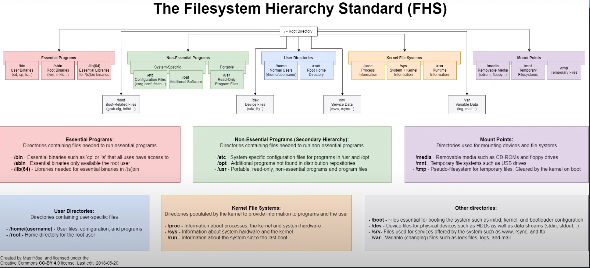
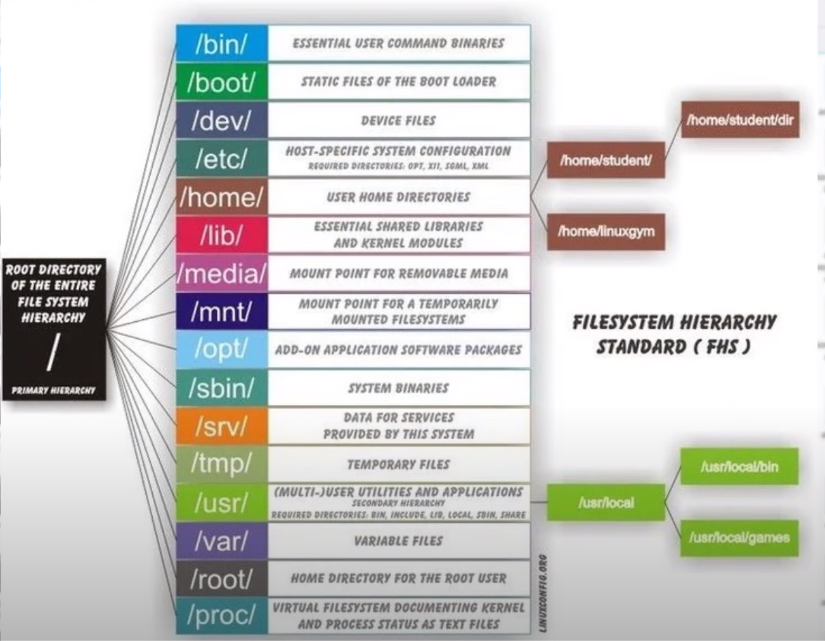

<a href="/README.md">вернуться к оглавлению</a>

<b>Файловая система - общая информация</b>   

<b>Особенности файловых систем Linux</b>  
Одной из особенностей файловых систем Linux является чувствительность   
к регистру - file.txt и FILE.txt будут файлами с разными названиями.   

Также в файловых системах Linux используются так называемые  
символические ссылки (сим-линки), это нечто похожее на ярлыки в Windows  
указывающие на тот или иной каталог или файл. Символьные ссылки используются   
для переименования файлов, например  для библиотек в том случае, когда   
библиотека содержит номер, а приложение, которое её использует, требует  
только название без номера.   

Структура каталогов и что в них должно находится описывается в документе  
под названием The Filesystem Hierarchy Standard  
  
однако разные Linux системы делают по-разному.  
Пример:  
   

<b>Описание некоторых разделов файловой системы</b>  
/bin - Binary (двоичные файлы) основных системных утилит командной строки  
/boot - основные файлы для загрузки системы  
/dev - Devices - файлы устройств (жесткие диски, принтеры, мыши и т.д.)   

Примечание: в Linux все считается файлом, поэтому в файловом менеджере  
мы видим различные устройства тоже как файлы   

/etc - etcetera - (и так далее) - конфигурационные файлы, настройки и ПО  
/lib - Library - разделяемые библиотеки системы и ПО, необходимые библиотеки   
для bin  
/lib32 и /lib64 - 32 и 64 битные версии библиотек   
/media - точки монтирования (подключения) накопителей, например флешки, cdrom,   
также сюда принято монтировать дополнительные жесткие диски или удаленные  
файловые системы
/mnt - Mount (монтирование) - ещё одна точка монтирования накопителей  
(вероятно в более ранних версиях), сейчас осталена для сохранения совместимости  
Иногда используется для монтирования файловых систем, или дистибутивов  
/opt - Optional (Опциональное, дополнительное). Размещение стороннего ПО,  
как правило - проприетарное, например Google Chrome, Opera, Discord и т.д.
/proc - Processes(Процессы) - Точка монтирования виртуальной файловой системы   
procfs, обеспечивающей доступ к информации о процессах из ядра Linux,  
а также здесь отображаются системные процессы  
/run - здесь отображается информация о системе в процессе загрузки 
(службах, демонах), Unix-сокеты, PID-файлы (процессы). Это информация временная  
и удаляется при каждой перезагрузке  
/sbin - аналог каталога /bin - вспомогательные утилиты администрирования  
/srv - сервисы, в настоящее время чаще всего не используется  
/sys - system - информация об оборудовании, предоставляемая ядром через  
виртуальную ФС sysfs, например температура процессора, обороты кулера и т.д.  
/tmp - temporary (временные файлы) - каталог для временных файлов, например  
распаковка архивов при их открытии  
/var - variable (меняющийся) - кеш программ, файлы блокировки (lock), логи,  
временные файлы программ, общая информация о системе, очередь печати и др. 
/usr - user (пользователь) - все, что относится к основному   
системному пользователю   
/home - домашние каталоги пользователей (домашние папки), содержат  
личные данные и настройки этих пользователей, аналог директории   
Users в Windows   

Примечание: чтобы сделать файл или каталог скрытым, перед его названием 
можно поставить точку   